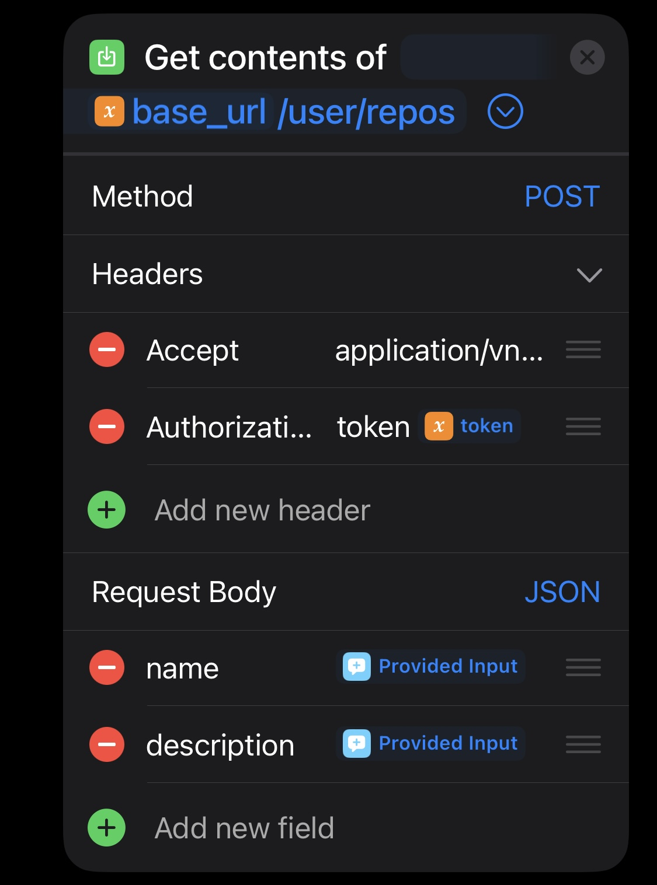

While the GitHub api isn’t necessary, it greatly speeds up development in the long run. Instead of going into the website to create or delete a repository, we can make a few taps on an iPhone. If you do a lot of development from a mobile device, having these capabilities is essential. The best part is that it can be done entirely within Shortcuts, which is native to iOS and doesn’t require downloading anything. 

## Step 1: Generate an API key on GitHub
- go to settings > developer settings > personal access tokens > fine grained tokens
- click on “generate new token
- set token name, expiration, and optionally a description 
- under repository access check “all repositories” 
- under repository permissions allow read & write for Administration, Commit statuses, and Contents 
- click generate token, then copy the token

## Step 2: Test token in shortcuts 
To simply test that our token works, we can make a quick shortcut
- create a text block and paste the access token from GitHub. This will be placed in the Authorization header later
- create a url block with <pre> `https://api.github.com/octocat`</pre> which will be the base for the API
- In get contents of url: set method to GET and create a header “Authorization” with “token YOURTOKEN”

If there are no errors, then the token is working and we can move on to creating a more sophisticated shortcut for interacting with the api

## Step 3: building the shortcut 
With the API, we can also create and delete repos, so when building a shortcut it’s useful to have options on what you want it to accomplish. This can be done by placing things into menu blocks. 
- choose from menu, then add “list, create, delete” as choices

1. In list, make a curl request with “Accept, Authorization” headers. In Accept, put `application/vnd.github+json` In authorization, put `token YOURTOKEN`

- get dictionary from curl 
- repeat with each item in dictionary 
- get value for “name” in repeat results 
- choose from list (repeat results) 

2. Under create, copy the curl block but change the method to POST. This will now give the option to add JSON to the request Body. 

- in request body, the first line is for “name”. This will be the repository name
- the next item in request body is “description” for a description of the repo
- I recommend adding 2 Ask for input blocks, and setting them to the request body 

3. In delete, copy the blocks from list. We do this because it’ll create a list and we can simply choose from that list to delete a repo
- add another url block with <pre> `https://api.github.com/repos/YOURACCOUNT/`</pre> and then immediately after the / add Chosen Item 
- add Show Alert with a message like “are you sure you want to delete repo?” so that the shortcut won’t continue without approval and you don’t delete a repo by accident

- create a curl request with DELETE method instead of GET/POST

Now the shortcut is essentially complete, but we can add one more choose from results block to better visualize JSON responses
- get dictionary from menu result
- choose from dictionary 

## Step 4: Test new shortcut
When launched, we will be shown the menu options we made

1. Create repo
- let’s run the shortcut, then choose the create option. Then choose any name and optionally put a description

- when complete, it should show a confirmation with details about new repo 

2. List repositories 
- To confirm we created a new repo and test that the list feature is also working, run the shortcut again and choose list

- it should show a list of all repositories for your account, including the one you just made. __Note: you may need to scroll down through the results if you have many repositories__
3. Delete a repo
- run the shortcut and select delete option, then choose the repo to delete. When asked if you want to continue, choose ok to continue with repo deletion

We now have a functional shortcut that interacts with the Github API to list, create, and delete repositories. Through other apps such as a-Shell and iSH, we can even use Shortcuts to push and pull commits, which we’ll cover in another tutorial. 