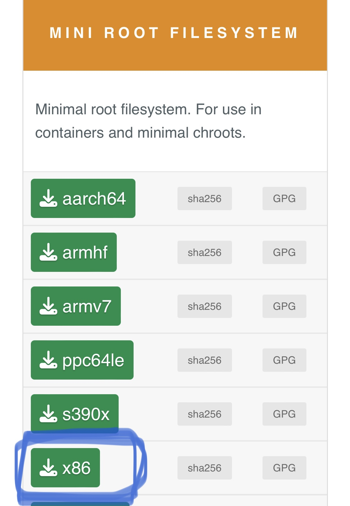
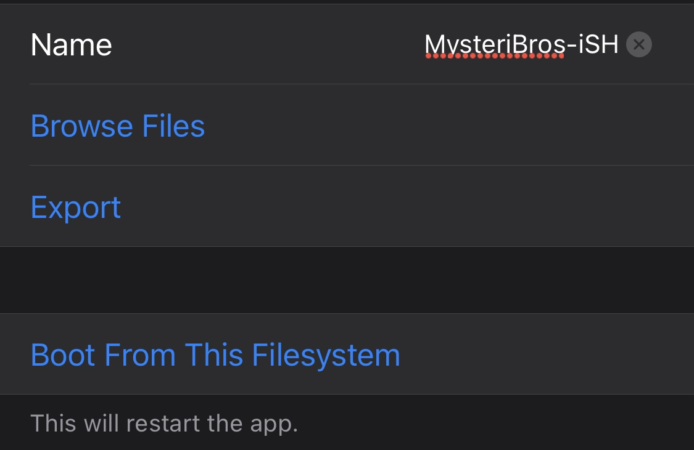
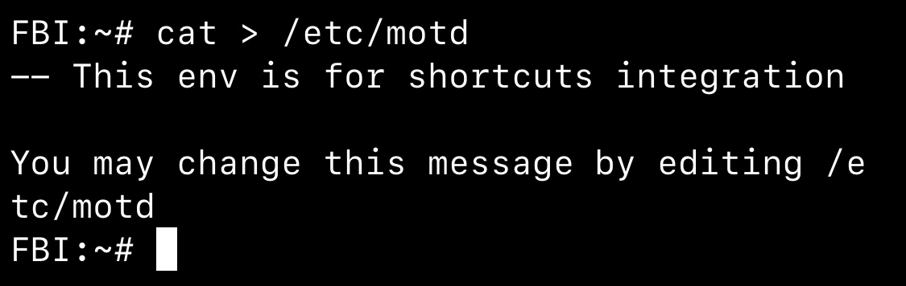
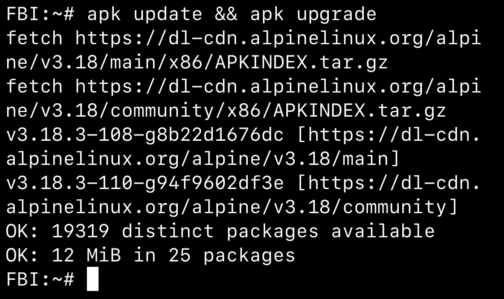
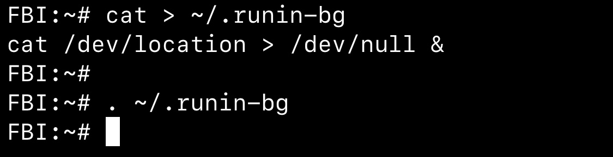
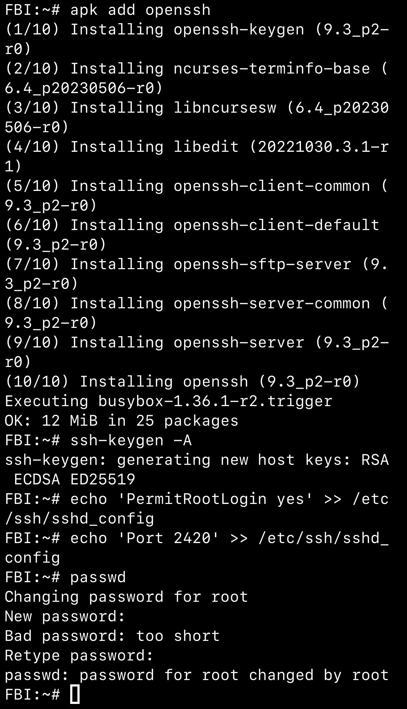
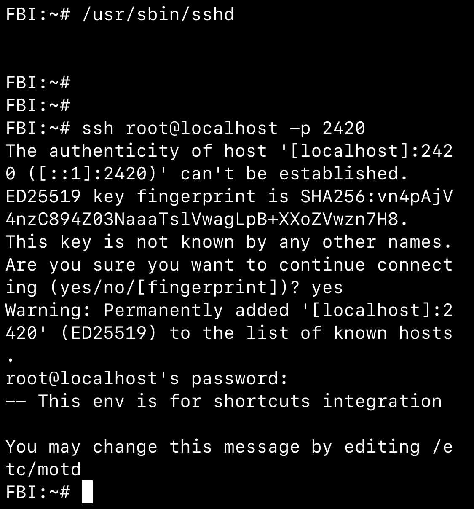
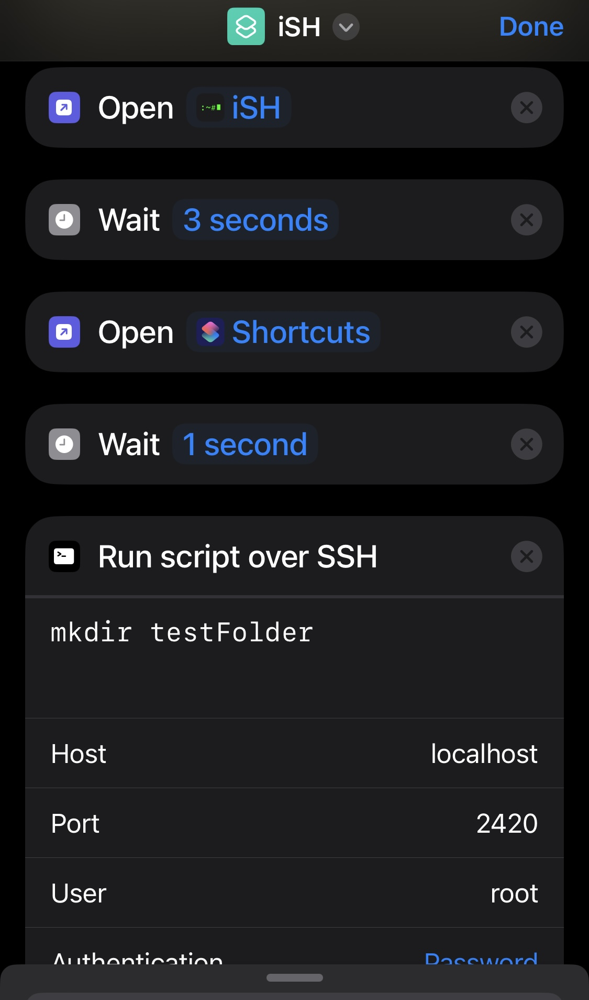
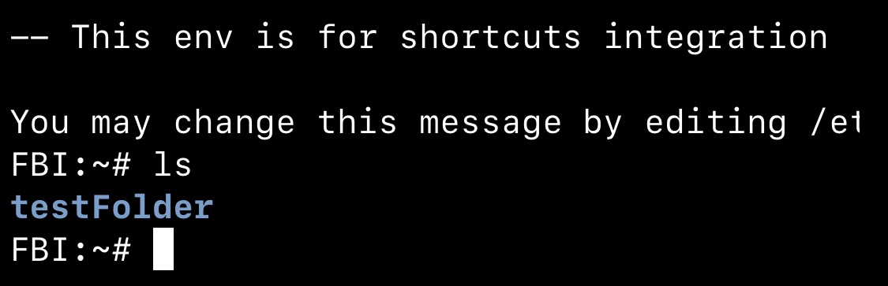

## Step 1: install iSH 
- On the App Store, search for ish or <a href="https://apps.apple.com/us/app/ish-shell/id1436902243" class="article-hyperlinks">click on this link</a> and install the app
- The app is just under 6MB and should not take very long to install

### Step 1b: update filesystem (recommended)
- Download the latest Alpine Linux mini root filesystem (~3MB) from the [official website](https://alpinelinux.org/downloads/). __make sure it is the “mini root filesystem x86” or it will not work in iSH__

- Open iSh app and click on the settings button, then filesystems, and click import. Select the file we just downloaded and a new filesystem should appear
- Click on the new filesystem, rename it, and click “Boot From This Filesystem”. The app will close, but once reopened the new filesystem will be active 


### Step 1c: customize welcome message (optional)
There are many ways to customize the UI from the settings that are pretty straightforward, so I will show how to edit the welcome message
- if you want to append to the message (add text at the end of the file) use the following command <pre>`cat >> /etc/motd`</pre> then add text. When done, click on the ^ symbol + D to save. 
- if you want to create a completely new welcome message, use the following command <pre> `cat > /etc/motd`</pre>
- The message can also be edited in another app on your device. The file can be located in the files app and opened. This may be simpler than editing within the shell 


- When iSH is restarted, your welcome message will be updated

## Step 2: update/upgrade packages
- Update and upgrade can be run in a single command <pre>`apk update && apk upgrade`</pre>


## Step 3: using profiles & running app in background 
Profiles are scripts that execute bash commands. They can be useful for many things, but they are necessary for integration with iOS Shortcuts. We will create a profile that will be used to keep the app running in the background
- Create a profile called “runin-bg” by using the command <pre> `cat > ~/.runin-bg`</pre> and then add the following line to the file <pre> `cat /dev/location > /dev/null &`</pre> and save it
- Run the file by using <pre> `. ~/.runin-bg`</pre> If done correctly, you should see location enabled on your device (if prompted, allow location tracking for the app). Location tracking uses up a lot of battery, but it’s what keeps the app running in the background. 

- Location tracking will stop when the app is closed, but it can also be manually stopped. Create a profile to stop it with <pre> `cat > ~/.stop-bg`</pre> and then put <pre> `killall -9 cat`</pre> inside the file and save. Run that profile the same way as the first one, and if done correctly you will notice location tracking stopped


## Step 4: Install SSH server
Shortcuts app cannot interact with iSH by default, but there is a workaround. We can run an ssh server in iSH then communicate with it via shortcuts. Here are the commands to install
<pre> `apk add openssh`</pre> - install ssh
<pre> `ssh-keygen -A`</pre> - generate host keys
<pre> `passwd`</pre> - to create root password 
<pre> `echo 'PermitRootLogin yes' >> /etc/ssh/sshd_config` </pre> - enable ssh connection with root user
<pre> `echo 'Port 2420' >> /etc/ssh/sshd_config`</pre> - change port for ssh so that device can connect to itself 

<pre> `/usr/sbin/sshd`</pre> - run ssh server 
<pre> `ssh root@localhost -p 2420`</pre> - test connection to ensure it’s working. If prompted, enter yes 

 
## Step 5: Shortcut integration 
The logic for creating a shortcut that can interact with iSH is as follows 
1. Open iSH app
2. Start SSH server
3. Return to shortcuts
4. Use SSH to send commands to the shell

In order to accomplish this, we will need iSH to automatically start location tracking and an SSH server when the app opens. This can be done by creating a profile called “profile”
<pre> `cat > ~/.profile`</pre>
Then the lines that run the commands we need
<pre>
```
# enable run in bg
. ~/.runin-bg
# enable ssh server
/usr/sbin/sshd
```
</pre>
Save the file. If done correctly, it should start an ssh server and be capable of running in the background whenever the app is opened


Now in the shortcuts app, you simply need to: 
1. Open app - iSH
2. Wait 3 seconds/Ask for input (so iSH has time to properly start everything up)
3. Open app - shortcuts
4. Wait 1 second
5. Run script over SSH - ensure port and credentials are correct

When that shortcut is run, it creates a new folder called testFolder. We can see if it worked by typing in ls in iSH

You can either set commands to be used in the last action, or you can ask for input in the shortcuts to run anything when the shortcut is executed. Instead of using a wait action, you can use ask for input to use custom commands each time
